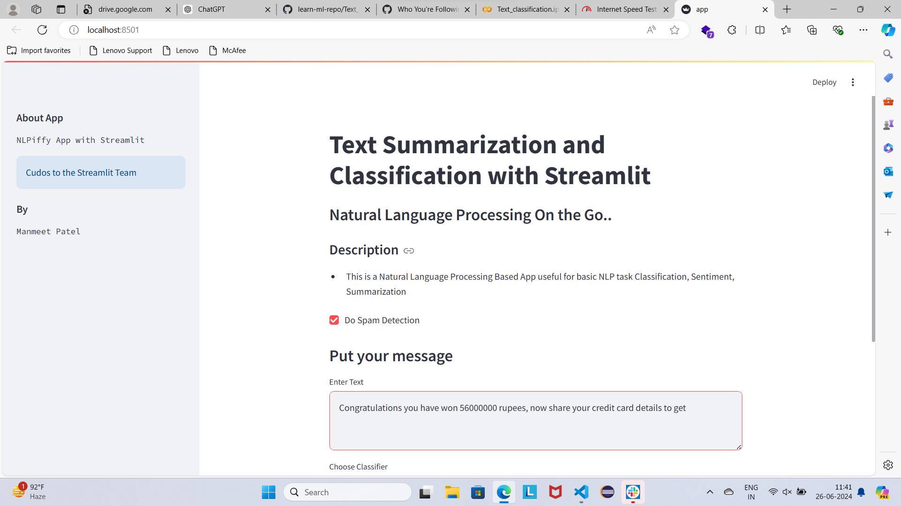
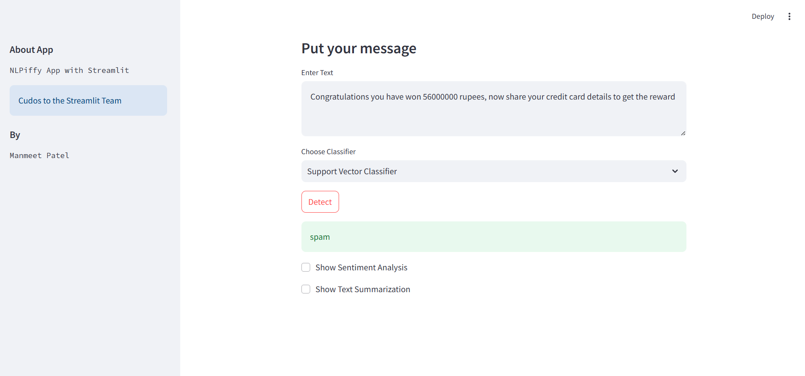
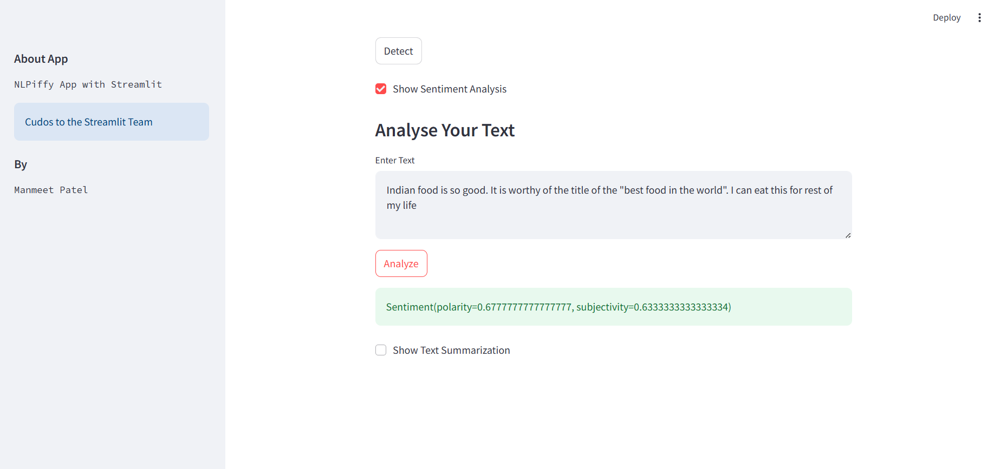
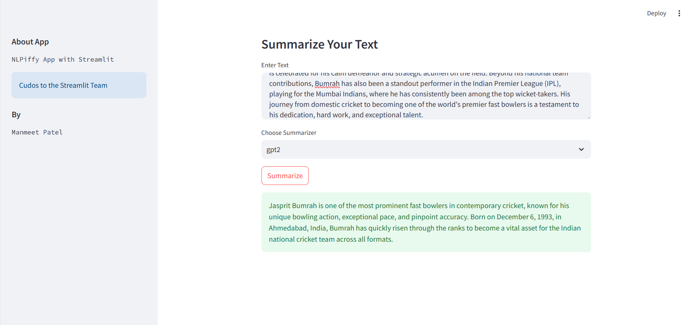

# NLP Based App with Streamlit

This is a Natural Language Processing Based App useful for spam detection, Sentiment Analysis, and Text Summarization.

## How to Run

1. Install the required packages:
    ```
    pip install -r requirements.txt
    ```

2. Run the Streamlit app:
    ```
    streamlit run app.py
    ```

## Features

- **Spam Detection**: Classify messages using different classifiers.
- **Sentiment Analysis**: Analyze the sentiment of the text.
- **Text Summarization**: Summarize text using GPT-2 or XLNet models.

## Screenshots

### Home Page


### Spam Detection


### Sentiment Analysis


### Text Summarization

